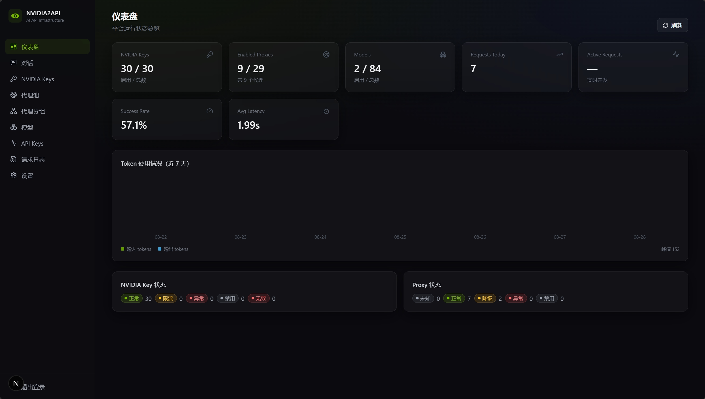

# NVIDIA2API

针对 NVIDIA AI API 的 API 聚合、代理加速、Key 池管理、代理池管理与 OpenAI 兼容中转平台。



## 核心能力

- **多线路并发竞速**：一次请求 = 每个启用代理 1 条线路 + 1 条直连线路，每条线路绑定**不同的** NVIDIA Key，`asyncio` 并发 + `FIRST_COMPLETED` + 响应有效性校验，第一个**有效 AI 响应**即为 Winner，其余线路立即取消（连接释放、无后台残留）。
- **流式响应**：支持 `stream=true` SSE，首个有效 chunk 到达即判定 Winner 并转发，其余线路取消。失败时返回真实 502/503 状态码（而非 200 内嵌错误），SDK 可正常重试。
- **连接复用**：全局共享事件循环 + httpx 连接池，代理/直连线路的 TCP+TLS 连接跨请求复用，显著降低重复握手延迟。
- **Key 池**：NVIDIA Key CRUD、批量导入（`name---key` 或纯 `key`，自动去重/自动命名）、默认 40 RPM、服务端滑动窗口限流（SQLite 原子条件更新）、429/401/403/5xx 自动冷却与状态管理（冷却时间可在设置页调整）。
- **代理池**：SOCKS5/HTTP/HTTPS（支持账号密码）、批量导入、并发异步测速（延迟 + 公网 IP + 地理位置）、异常自动冷却；启用数量由后端强制 `≤ NVIDIA Key 数 - 1`（`N` 个 Key → 最多 `N-1` 代理 + 1 直连 = `N` 条线路）。
- **模型管理**：从 NVIDIA 同步模型、启停控制，仅 `enabled=true` 的模型通过 OpenAI API 暴露。模型列表来自 NVIDIA 公开端点，**同步无需任何 Key**（空库也能同步）。同步与上游对齐：上游已下架的模型自动软下架（`status=retired` + 禁用，不删记录），上游恢复后自动清除标记。
- **OpenAI 兼容 API**：`GET /v1/models`、`POST /v1/chat/completions`（含非流式与 `stream=true`）、`GET /health`。
- **用户 API Key**：`sk-nvidia2api-*`，仅存 SHA-256 Hash（创建时完整展示一次），支持每 Key 独立限流、允许模型白名单（`allowed_models`）与统计。
- **请求日志**：request_id、耗时、TTFT、Winner 线路、Key、代理、状态、Token 统计，敏感字段脱敏；支持分页、时间/模型/状态筛选；`python manage.py clean_logs` 定期清理。
- **Dashboard**：Key/Proxy/Model/请求量/成功率/平均延迟/今日 Tokens/实时并发统计与实时状态（15 秒自动刷新）。
- **管理后台**：`/api/admin/login`（用户名密码 → 固定 Token）鉴权，登录防爆破（5 分钟 10 次），支持 `Authorization: Bearer` 与 `Token` 两种头。

## 技术栈

- **后端**：Python 3.12+、Django 6、DRF、SQLite、httpx（`httpx[socks]`/`httpx-socks`）、asyncio、uvicorn
- **前端**：Next.js 16、React 19、TypeScript、Tailwind CSS、lucide-react

## 结构

```
backend/     Django（config/ 配置、apps/core/ 数据模型、services/ 业务服务、
             api/ Admin + OpenAI API、tests/ 27 个测试）
frontend/    Next.js 控制台（dashboard、nvidia-keys、proxies、
             models、api-keys、request-logs、settings、login）
data/        SQLite 数据目录（Docker 卷挂载点）
docs/        架构、数据库、模块、竞速引擎、Admin/OpenAI API、前端、部署
```

## 快速开始

```bash
cp .env.example .env

# 后端
cd backend
pip install -r requirements.txt
python manage.py migrate
python -m pytest tests          # 27 个测试：导入/限流/代理限制/竞速/并发安全
python manage.py runserver 0.0.0.0:8000

# 前端
cd frontend
npm install
npm run dev                     # http://localhost:3000
```

默认管理员 `admin / admin123`，可通过 `.env` 的 `ADMIN_USERNAME/ADMIN_PASSWORD/ADMIN_TOKEN` 修改。Admin API 使用 `Authorization: Bearer $ADMIN_TOKEN` 鉴权。

> **安全提醒**：生产部署务必修改默认口令（见「常见问题」）。

## Docker

```bash
cp .env.example .env   # 修改 ADMIN_PASSWORD / ADMIN_TOKEN / SECRET_KEY！
docker compose up -d
```

单镜像运行前后端：仅暴露 Next.js `3000` 端口，Django 只监听容器内 `127.0.0.1:8000`，由 Next.js rewrites 将 `/api`、`/v1` 反代到后端。SQLite 数据保存在宿主 `./data`（已挂载到容器 `/app/data`），容器销毁不丢数据。容器内置健康检查（`/health`）；任一进程退出容器即重启。

**注意**：`docker-compose.yml` 通过 `env_file` 加载 `.env`，所有环境变量（包括管理口令）请统一在 `.env` 中修改，不要只改 compose 文件。

## 使用流程

1. 登录控制台 → **NVIDIA Keys** → 批量导入 Key（`主账号01---nvapi-xxx` 或每行一个 `nvapi-xxx`，自动去重/自动命名）
2. **Proxies** → 批量导入代理、测速、获取 IP、启用（数量受 Key 数 - 1 限制）
3. **Models** → 点击「同步 NVIDIA 模型」，启用要暴露的模型
4. **API Keys** → 创建用户 Key（完整 Key 仅显示一次）
5. 用 OpenAI SDK 调用：

```python
from openai import OpenAI

client = OpenAI(api_key="sk-nvidia2api-xxxx", base_url="http://localhost:8000/v1")
resp = client.chat.completions.create(
    model="meta/llama-3.3-70b-instruct",
    messages=[{"role": "user", "content": "你好"}],
    stream=False,
)
print(resp.choices[0].message.content)
```

## 竞速机制

```
用户 → 验证 Key / 模型 / 限流 → build_routes()
  代理A + Key1 ┐
  代理B + Key2 ├ asyncio 并发 (FIRST_COMPLETED)
  直连  + Key3 ┘
        ↓
  is_valid_response() 判定首个"有效 AI 响应"为 Winner → 取消其余任务 → 返回用户
```

- **不是**"最快连接建立"即是 Winner，必须获得有效 AI 回复（HTTP 200 + 有 choices + 有 message/delta 且无 error 字段）。
- 单代理/单 Key 故障不影响整体请求；429 → Key 标记 `rate_limited` + 冷却（可在设置页配置 `key_cooldown_seconds`，默认 60s）；401/403 → 标记 `invalid`。
- 流式：首个有效 SSE chunk 到达即判定 Winner，随后转发剩余 chunk，其余线路立即取消。**竞速在返回 HTTP 状态码之前完成**——全部线路失败时客户端收到真实的 502/503。
- 每条线路的 Key 分配使用轮换 + LRU + RPM + 失败率 + 冷却状态综合调度，请求间尽量避免重复 Key。

## 配额消耗须知（重要）

竞速会对每条候选线路分别向上游发起真实请求并占用对应 Key 的 RPM 配额：

- 每个启用代理线路 + 1 条直连 = 每次用户请求消耗 **K 个 Key 配额**（K = 本次竞速线路数）。
- 败者线路的上游请求会被尽快取消，但 NVIDIA 侧通常已计入受理。
- 因此 **实际可用吞吐 ≈ Σ(Key RPM) / 竞速线路数**。例如 3 个 Key × 40 RPM、3 条线路竞速 → 用户侧约 40 请求/分钟，而不是 120。
- 若吞吐优先于延迟，可在设置页调小 `max_routes_per_request`（如设为 1 = 不竞速，等价轮询负载均衡）。

## 并发与限流说明

- Key 的 RPM 计数使用 SQLite 条件更新（`UPDATE ... WHERE count < rpm_limit`）保证原子性，多线程下不会超限（有并发测试验证）。
- 用户 Key 的 429 响应带 `Retry-After` 头；参数校验失败不消耗配额；每个响应带 `X-Request-Id` 便于对账。
- 提供全局并发信号量（`MAX_CONCURRENT_REQUESTS`）、单请求线路数上限（`MAX_ROUTES_PER_REQUEST`）、上游超时（`UPSTREAM_CONNECT/READ_TIMEOUT`）等保护，防止资源耗尽。
- 项目预留了迁移 PostgreSQL/Redis 的结构空间，当前仅用 SQLite。

## 环境变量

见 [.env.example](.env.example) 与 [docs/deployment.md](docs/deployment.md)：

```
SECRET_KEY / DEBUG / DATA_DIR / DATABASE_PATH
ADMIN_USERNAME / ADMIN_PASSWORD / ADMIN_TOKEN
CORS_ALLOWED_ORIGINS
NVIDIA_BASE_URL / DEFAULT_NVIDIA_RPM
MAX_CONCURRENT_REQUESTS / MAX_ROUTES_PER_REQUEST
PROXY_TIMEOUT / UPSTREAM_CONNECT_TIMEOUT / UPSTREAM_READ_TIMEOUT
LOG_LEVEL / NEXT_PUBLIC_API_BASE_URL
```

## 常见问题

- **没有可用 Key / 线路**：确认已导入并启用 NVIDIA Key（`available` 状态），且启用代理数 ≤ Key 数 - 1。
- **模型 404**：模型需在 Models 页启用（`enabled=true`）后才通过 `/v1` 暴露；若用户 Key 设置了 `allowed_models` 白名单，模型还需在白名单内。
- **429**：要么用户 API Key 达到自身限流（响应带 `Retry-After`），要么所有 NVIDIA Key 均处于 `rate_limited`/冷却中。注意竞速会放大配额消耗，见「配额消耗须知」。
- **代理测速失败**：确认协议格式（`socks5://host:port` 等）与连通性；测速失败不影响其他代理，也不影响请求整体成功。
- **生产安全清单**：
  1. 修改 `ADMIN_PASSWORD` / `ADMIN_TOKEN` / `SECRET_KEY`（默认值仅供首次启动）；
  2. 不要将端口直接暴露公网时保留默认口令；
  3. 登录接口自带防爆破（5 分钟 10 次失败锁定），如需更强防护请加反向代理层限流；
  4. 请求日志会持续增长，建议 cron 定期 `python manage.py clean_logs --days 30`。

## 文档

详见 [docs/](docs)：架构、数据库、后端模块、竞速引擎、Admin API、OpenAI API、前端、部署。

## 许可

[MIT](LICENSE)
